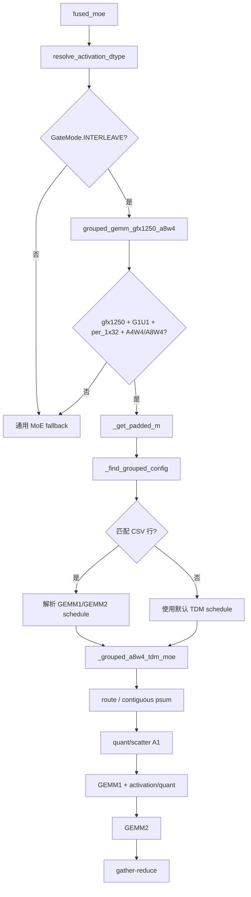

# `tuned_grouped_fmoe.csv` 按 token 数选择 MoE kernel 组合的机制分析

## 1. 分析范围与结论

本文分析当前 `hyg/moe_a4w4_pr_refactor` 中 gfx1250 grouped MoE 路径如何以
[`aiter/configs/tuned_grouped_fmoe.csv`](../aiter/configs/tuned_grouped_fmoe.csv)
为调优表，根据输入 token 数及模型形状选择不同的 GEMM1/GEMM2 kernel 组合，并说明这些
组合为什么仍实现等价的 MoE 数学计算。

主要代码入口为：

- [`aiter/fused_moe.py`](../aiter/fused_moe.py)：通用 `fused_moe` 前端和 grouped 路径入口。
- [`aiter/ops/flydsl/grouped_moe_gfx1250.py`](../aiter/ops/flydsl/grouped_moe_gfx1250.py)：
  token bucket、CSV 匹配、route/quant/GEMM/gather pipeline。
- [`aiter/ops/flydsl/grouped_gemm_mxfp4.py`](../aiter/ops/flydsl/grouped_gemm_mxfp4.py)：
  把 CSV tile 参数解析成具体 FlyDSL launcher，并在普通、optimized、persistent launcher
  之间选择。
- `mxfp4_preshuffle_gfx1250_tdm*.py`：实际 GEMM kernel。

核心结论如下：

1. CSV 并不直接按原始 token 数查找，而是先将 token 数映射到一个离散 bucket。
2. CSV 的一行描述的是一整组 GEMM1/GEMM2 schedule，包括两阶段各自的 tile、wave、buffer、
   cluster 和 TDM 参数。
3. 选择过程是“bucket 后精确匹配”，不是最近邻搜索；没有匹配行时使用默认 TDM 配置，
   再不满足 grouped 路径条件时才回退到外层通用 MoE。
4. 不同 schedule 只改变 routed row 的物理排列、tile 划分、并行 ownership 和数据搬运方式；
   route map、边界保护、量化格式契约和最终 gather 保证逻辑结果等价。
5. 某些高度特化的 launcher 还会检查原始 token 数。例如 E64/T1536 的 fused persistent
   GEMM1 要求 `token_num == 1536`；同属 CSV `token=2048` bucket 的其他 token 数不一定会
   使用同一个最终 kernel。

## 2. MoE 的逻辑计算保持不变

对 token `t`，router 给出 `topk` 个 expert `e(t,j)` 及权重 `p(t,j)`。忽略 bias 时，
Silu/G1U1 MoE 的逻辑计算可写为：

```text
gate(t,j) = W1_gate[e(t,j)] · x[t]
up(t,j)   = W1_up[e(t,j)]   · x[t]
act(t,j)  = SiLU(gate(t,j)) * up(t,j)
down(t,j) = W2[e(t,j)] · act(t,j)
y[t]      = Σ_j p(t,j) * down(t,j)
```

在当前 A4W4 pipeline 中：

- GEMM1：`K=model_dim`，逻辑输出宽度 `N=2*inter_dim`，计算 gate/up。
- GEMM1 epilogue：执行 SiLU；满足融合条件时同时把 GEMM2 输入量化成 MXFP4 并生成
  E8M0 scale，否则由后续 standalone quant kernel 完成相同转换。
- GEMM2：`K=inter_dim`，输出宽度 `N=model_dim`。
- gather-reduce：按原 token/top-k 关系取回 routed row，乘 route weight 后求和。

CSV 选择的 kernel 组合只改变上述阶段的实现方式，不改变这个数学定义。

## 3. 从 `fused_moe` 到 CSV 的调用链



[`fused_moe.py:1202`](../aiter/fused_moe.py) 只有在 `GateMode.INTERLEAVE` 下才尝试
`grouped_gemm_gfx1250_a8w4`，因为 grouped GEMM1 要求 `w1` 已经是 GUGU
`[g0,u0,g1,u1,...]` 物理布局。

`grouped_gemm_gfx1250_a8w4` 还会检查：

- grouped 路径已启用；gfx1250 上默认启用，也可由 `AITER_USE_GROUPED_GEMM` 打开。
- 未设置 `AITER_DISABLE_GROUPED_A8W4=1`。
- `isG1U1=True`。
- `quant_type == QuantType.per_1x32`。
- activation 是 `Silu`、`Swiglu` 或 `Situv2`。
- activation/weight 格式构成 A4W4 或 A8W4。
- `w1_scale` 和 `w2_scale` 均存在。
- 目标架构是 gfx1250，或显式使用了 gfx1250 override。

任一条件不满足时，该函数返回 `None`，外层继续尝试其他 MoE 实现。

## 4. token 数先映射到离散 bucket

token bucket 的实现位于
[`grouped_moe_gfx1250.py:132`](../aiter/ops/flydsl/grouped_moe_gfx1250.py)：

```python
_PADDED_M_TIERS = [32768, 131072]

def _get_padded_m(m):
    if m < 32768:
        return next_power_of_two(m)
    if m >= 131072:
        return 131072
    return 32768
```

常见映射如下：

| 原始 token 数 | CSV lookup token |
|---:|---:|
| 1 | 1 |
| 2 | 2 |
| 3–4 | 4 |
| 5–8 | 8 |
| 9–16 | 16 |
| 17–32 | 32 |
| 33–64 | 64 |
| 65–128 | 128 |
| 129–256 | 256 |
| 257–512 | 512 |
| 513–1024 | 1024 |
| 1025–2048 | 2048 |
| 2049–4096 | 4096 |
| 4097–8192 | 8192 |
| 8193–16384 | 16384 |
| 16385–32767 | 32768 |
| 32768–131071 | 32768 |
| ≥131072 | 131072 |

这里的 bucket 只用于配置查找，不是实际 buffer 大小，也不会截断参与计算的 token。
例如 50000 个 token 仍然完整计算，只是用 `token=32768` 的 schedule 配置。

对于普通非 EP 路径，lookup 输入是 `topk_ids.shape[0]`。对于 compact EP 路径，
lookup 使用本 step 的 `compact_recv_bound`；如果没有该 bound，则使用
`max_tokens_per_rank * world_size`。这是为了避免 decode step 因 arena 容量很大而错误选择
full-prefill tile。

`token_num == 0` 是特殊情况：直接返回形状为 `(0, model_dim)` 的零张量，不启动 route/GEMM
kernel。

## 5. CSV 匹配不是只看 token

配置匹配函数是
[`grouped_moe_gfx1250.py:142`](../aiter/ops/flydsl/grouped_moe_gfx1250.py)
中的 `_find_grouped_config`。完整匹配键包括：

| 类别 | 字段 |
|---|---|
| 硬件 | `gfx`, `cu_num` |
| workload | bucket 后的 `token`, `model_dim`, `inter_dim`, `expert`, `topk` |
| 算子语义 | `act_type`, `dtype`, `q_type` |
| 量化格式 | `q_dtype_a`, `q_dtype_w` |
| EP 模式 | `ep_fused` |

匹配规则有几个容易忽略的细节：

1. `gfx` 是硬约束；先精确匹配 `cu_num`，没有结果时才忽略 `cu_num` 再匹配。
2. CSV 中空单元格、`nan`、`none` 作为 wildcard，不限制该字段。
3. 非 EP 使用真实 `topk`；EP 使用 `topk=-1`，匹配 EP-agnostic 行。
4. `ep_fused` 留空的行同时服务普通和 fused scatter 路径；如果存在显式 `ep_fused`
   匹配行，则显式行优先。
5. 如果多行都匹配，优先选择 `us>0` 且 `us` 最小的实测行；`us` 为空或 0 的行排序到
   最后，避免“未测量的 0 us”被误认为最快。
6. 没有最近邻或自动向下查找。bucket、shape、dtype 等键匹配失败后，直接使用默认参数。

配置文件来源默认是 `aiter/configs/tuned_grouped_fmoe.csv`，也可通过
`AITER_CONFIG_GROUPED_FMOE` 指向一个或多个以 `os.pathsep` 分隔的 CSV。解析结果按路径缓存，
`_find_grouped_config` 也有 LRU cache；在同一 Python 进程内直接改 CSV 后，通常需要重启进程
才能保证重新读取。

## 6. CSV 一行如何定义一组 kernel

当前 CSV 有 48 列、120 行，其中：

| activation format | 行数 | 已覆盖的 token bucket |
|---|---:|---|
| A4W4：`torch.float4_e2m1fn_x2` | 50 | 8–32768，共 13 个 bucket |
| A8W4：`torch.float8_e4m3fn` | 70 | 1–32768，共 16 个 bucket |

一行中的主要 schedule 字段可以分为以下几组。

### 6.1 GEMM1 schedule

```text
tile_m, tile_n, tile_k
m_warp, n_warp
num_buffers
cluster_m, cluster_n
waves_per_tensor_tdm
```

GEMM1 的矩阵形状为：

```text
M = routed/packed rows
N = 2 * inter_dim
K = model_dim
```

### 6.2 GEMM2 schedule

```text
tile_m2, tile_n2, tile_k2
m_warp2, n_warp2
num_buffer_stage2
cluster_m2, cluster_n2
waves_per_tensor_tdm2
```

空的 stage2 字段通常回退到 stage1 对应值。例如：

```text
tile_m2              -> tile_m
num_buffer_stage2    -> num_buffers
waves_per_tensor_tdm2 -> waves_per_tensor_tdm
cluster_n2           -> cluster_n
```

GEMM2 的矩阵形状为：

```text
M = 与 GEMM1 共用的 routed/packed rows
N = model_dim
K = inter_dim
```

### 6.3 pipeline 与硬件提示

```text
next_stage_prefetch
tdm_as_in_prologue
tdm_b_th
lds_soa_load_interleave
```

- `next_stage_prefetch=1`：允许下一 stage 的 TDM load 提前发射。
- `tdm_b_th`：B operand TDM temporal hint，合法值为 0–6。
- `lds_soa_load_interleave`：选择新的 LDS SoA/interleave 读取模式。
- `cluster_m/n`：控制 workgroup cluster 的几何形状；非法或不能整除 N tile 数时，
  `cluster_n` 会回退到 1。

这些字段是否最终生效还取决于 launcher family。例如当前专用 A-preshuffle/persistent
launcher 不接收 `lds_soa_load_interleave` 参数，所以该字段只影响 generic TDM launcher；
不能仅根据 CSV 单元格判断最终 ISA。

### 6.4 兼容/元数据字段

`kernelName1`、`kernelName2`、`max_m`、`split_k1/2`、`grouped_persistent_m`、
`persistent_workers` 等字段属于调优表兼容 schema。当前
`grouped_gemm_gfx1250_a8w4 -> _grouped_a8w4_tdm_moe` 路径主要读取 tile、wave、buffer、
cluster 和 TDM 字段，并不通过 `kernelName1/2` 直接实例化 kernel；实际 launcher 由
`grouped_gemm_mxfp4.py` 根据解析后的参数再次判定。

`max_m` 也不是本路径实际分配 routed buffer 的直接输入。运行时会根据真实
`token_num * topk` 和 tile alignment 重新计算 `max_m`/`contiguous_m`。因此 CSV 中的
`max_m` 更接近调优记录和兼容字段。

## 7. token 增大时，kernel 组通常如何变化

具体 schedule 同时依赖模型形状、expert 数、topk 和量化格式，不能只按 token 给出一张全局
唯一映射。但 CSV 中可观察到以下常见趋势。

### 7.1 小 token：优先减少空 tile 和启动成本

常见配置：

```text
tile_m = 16 或 32
tile_n = 256 或 512
tile_k = 128 或 256
m_warp x n_warp = 1 x 4
num_buffers = 2
cluster_n = -1/1
next_stage_prefetch = 0
```

小 token 下每个 expert 的有效行很少。较小的 `tile_m` 可减少 padding 和无效 block；较少的
buffer 和不启用 cluster/prefetch 可降低固定开销。

### 7.2 中等 token：增加 `tile_m` 或 pipeline 深度

常见变化：

- `tile_m` 从 16 提升到 32/64。
- 某些形状将 `num_buffers` 从 2 提升到 3。
- `next_stage_prefetch` 开始启用。
- GEMM1 和 GEMM2 可使用不同的 `tile_n/tile_k`，因为两阶段的 K/N 维度不同。

### 7.3 大 token：偏向大 tile、2x2 wave 和 cluster multicast

典型大 batch 配置：

```text
tile_m x tile_n x tile_k = 256 x 256 x 256
m_warp x n_warp = 2 x 2
num_buffers = 3 或 4
cluster_n = 4
next_stage_prefetch = 1
```

大 token 时有足够 routed rows 填满大 tile，较大的 `tile_m` 减少 block 数和调度开销；
`cluster_n=4` 让同一 M tile 的 A/ScaleA 在多个 N workgroup 间 multicast；更多 buffer 和
prefetch 用于隐藏 TDM latency。

## 8. E96/M7168/I3072/A4W4 的 token 分段示例

以下表格展示同一模型形状在非 EP、`topk=6` 下随 bucket 变化的主要 schedule。它说明 CSV
选择的是完整 kernel 组合，而不是只调一个 `tile_m`。

| token bucket | GEMM1 tile / wave / buffers | GEMM2 tile / wave / buffers | cluster/prefetch |
|---:|---|---|---|
| 8–128 | `16x512x128`, `w1x4`, b2 | 同 GEMM1 | 无 cluster，prefetch=0 |
| 256 | `32x512x128`, `w1x4`, b2 | 同 GEMM1 | 无 cluster，prefetch=0 |
| 512 | `64x256x256`, `w1x4`, b3 | `64x512x128`, `w1x4`, b3 | `tdm_as_in_prologue=1`, `tdm_b_th=1` |
| 1024–4096 | `64x512x128`, `w1x4`, b2 | 同 GEMM1 | 无 cluster，prefetch=0 |
| 8192 | `256x256x256`, `w2x2`, b4 | 同 GEMM1 | `cluster_n=4`, wpt=1, prefetch=1 |
| 16384 | `256x256x256`, `w2x2`, b4 | 同 GEMM1 | `cluster_n=4`, wpt=2, prefetch=1 |
| 32768 | `256x256x256`, `w2x2`, b3 | 同 GEMM1 | `cluster_n=4`, wpt=1, prefetch=1 |

这不是简单的单调关系。例如 512 bucket 使用三 buffer 和不同 GEMM2 K tile，是针对该形状的
实测结果；1024–4096 又回到两 buffer。CSV 的作用正是保存这些无法由固定启发式完整表达的
离散最优点。

## 9. E64/T1536/topk8/M7168/I2048 的完整选择过程

这是当前重点优化形状。实际 token 数为 1536：

```text
_get_padded_m(1536) = 2048
```

因此命中 CSV 第 117 行的 `token=2048` 配置：

| 参数 | GEMM1 | GEMM2 |
|---|---:|---:|
| tile | `192x256x256` | `192x256x256` |
| wave grid | CSV 为 `w2x2` | `w2x4` |
| buffers | 4 | 4 |
| cluster | `1x4` | `1x4`（`cluster_n2` 空，继承 4） |
| waves per TDM | 2 | 空，继承 2 |
| prefetch | 1 | 1 |
| `tdm_b_th` | 6 | GEMM2 专用 persistent 路径固定为 0 |
| `lds_soa_load_interleave` | CSV=1；专用 launcher 不消费该参数 | 同左 |

这里还存在一层基于原始 token 数的 specialization：

```python
_fused_gemm1_n_warp = 4 if (
    token_num == 1536
    and E == 64
    and topk == 8
    and model_dim == 7168
    and inter_dim == 2048
    and tile_m == 192
    ...
) else n_warp
```

所以实际 GEMM1 从 CSV 的 `w2x2` 提升为 `w2x4`，随后
[`grouped_gemm_mxfp4.py:350`](../aiter/ops/flydsl/grouped_gemm_mxfp4.py)
识别出：

```text
stage1_quant_out=1
stage1_act=1
N=4096
K=7168
tile=192x256x256
wave=2x4
E=64
cluster=1x4
```

并选择：

```text
launch_gemm_a8w4_tdm_fused_persistent
```

GEMM2 的参数为：

```text
stage1_act=0
N=7168
K=2048
tile=192x256x256
wave=2x4
E=64
```

因此选择：

```text
launch_gemm_a8w4_tdm_gemm2_persistent
```

也就是说，该 workload 最终使用的是：

```text
route/quant/scatter
  -> fused persistent GEMM1 + SiLU + GEMM2-input quant
  -> persistent GEMM2
  -> gather-reduce
```

同属 `token=2048` bucket 的实际 token=2048 workload 不满足 `token_num == 1536`，因此不会
自动得到同一个 fused GEMM1 `w2x4` specialization。这说明 CSV bucket 是第一层选择，原始
shape specialization 是第二层选择。

### 9.1 六个指定规模的最终 GEMM1/GEMM2 选择

下面的推导假设使用题目给出的命令，未额外设置 tuning override，并沿用
`run_moe_prefill_switch_ab.sh` 的默认值：

```text
AITER_FLYDSL_GEMM1_FUSED_QUANT=1
const0
无 bias
GateMode.INTERLEAVE
```

表中的 `generic`、`optimized` 和 `persistent` 分别对应：

```text
generic:
  launch_gemm_a8w4_tdm

optimized:
  launch_gemm_a8w4_tdm_optimized

fused persistent GEMM1:
  launch_gemm_a8w4_tdm_fused_persistent

persistent GEMM2:
  launch_gemm_a8w4_tdm_gemm2_persistent
```

| 规模 | token bucket / CSV | GEMM1 最终选择 | GEMM2 最终选择 |
|---|---|---|---|
| E64/T1536/topk8/M7168/I2048 | `1536 -> 2048`，命中 E64/t192 行 | `t192x256x256`, `w2x4`, b4, cluster `1x4`, `q1r6`；**fused persistent GEMM1** | `t192x256x256`, `w2x4`, b4, cluster `1x4`；**persistent GEMM2** |
| E64/T16384/topk8/M7168/I2048 | `16384 -> 16384`，命中 E64/t256 行 | `t256x256x256`, `w2x2`, b4, cluster `4x4`, `q1r8`；**optimized** | `t256x256x256`, `w2x2`, b4, cluster `1x4`；**optimized** |
| E256/T512/topk8/M7168/I2048 | `512 -> 512`，**无匹配 CSV 行** | 实际函数默认 `t64x256x256`, `w1x4`, b3, cluster `1x1`, `q1r4`；**generic** | 实际函数默认 `t64x256x256`, `w1x4`, b3, cluster `1x1`；**generic** |
| E256/T16384/topk8/M7168/I2048 | `16384 -> 16384`，命中 E256/t256 行 | `t256x256x256`, `w2x2`, b4, cluster `4x4`, `q1r8`；**optimized** | `t256x256x256`, `w2x2`, b4, cluster `1x4`；**optimized** |
| E96/T512/topk6/M7168/I3072 | `512 -> 512`，两行匹配，选择 `us=468.0528` 行 | `t64x256x256`, `w1x4`, b3, prefetch + `asprol`, `bth1`, `q1r4`；**generic** | `t64x512x128`, `w1x4`, b3, prefetch + `asprol`, `bth0`；**generic** |
| E96/T16384/topk6/M7168/I3072 | `16384 -> 16384`，命中 E96/t256 行 | `t256x256x256`, `w2x2`, b4, cluster `4x4`, `q1r8`；**optimized** | `t256x256x256`, `w2x2`, b4, cluster `1x4`, `K=3072`；**optimized** |

#### 规模 1：E64/T1536/topk8/M7168/I2048

CSV 提供：

```text
GEMM1: tile=192x256x256, wave=2x2, buffers=4
GEMM2: tile=192x256x256, wave=2x4, buffers=4
cluster_m/cluster_n = 1/4
cluster_m2/cluster_n2 = 1/继承4
next_stage_prefetch=1
waves_per_tensor_tdm=2
tdm_b_th=6
```

生产路径中 `_fused_gemm1_n_warp` 的原始 token 精确条件将 GEMM1 从 CSV 的 `w2x2`
改成 `w2x4`。因此：

```text
GEMM1 launcher:
  launch_gemm_a8w4_tdm_fused_persistent

GEMM1 symbol 前缀:
  a8w4_tdm_fp4_t192x256x256_w2x4_b4_K7168_e64_act1_q1r6

GEMM2 launcher:
  launch_gemm_a8w4_tdm_gemm2_persistent

GEMM2 symbol 前缀:
  a8w4_tdm_fp4_t192x256x256_w2x4_b4_K2048_e64
```

这是六个规模中唯一同时命中特制 fused persistent GEMM1 和专用 persistent GEMM2 的规模。

#### 规模 2：E64/T16384/topk8/M7168/I2048

CSV 行为两阶段都配置 `t256x256x256/w2x2/b4`，`cluster_n=4`、prefetch=1。
`cluster_m` 为空时，GEMM1 因 `stage1_act=1 && cluster_n=4` 自动选择 `cluster_m=4`；
GEMM2 的 `stage1_act=0` 使 `cluster_m2` 自动选择 1。

该规模支持 A-preshuffle，但不满足 t192/E64 persistent specialization：

```text
GEMM1:
  launch_gemm_a8w4_tdm_optimized
  symbol 前缀 = a8w4_tdm_fp4_t256x256x256_w2x2_b4_K7168_e64_act1_q1r8

GEMM2:
  launch_gemm_a8w4_tdm_optimized
  symbol 前缀 = a8w4_tdm_fp4_t256x256x256_w2x2_b4_K2048_e64
```

CSV 的 `waves_per_tensor_tdm=1` 会在 A-preshuffle optimized 路径中被解析为 2，因为
`target_optimized` 为真时 launcher 明确固定 `waves_per_tensor_tdm=2`。

#### 规模 3：E256/T512/topk8/M7168/I2048

当前 CSV 没有该完整 key 的 `token=512` 行。这里不会借用 E96/E256 其他模型形状的 512
配置，也不会向 256 或 1024 bucket 做最近邻查找。

`cfg_row=None` 后，真正进入 `_grouped_a8w4_tdm_moe` 的是函数默认参数：

```text
tile_m/tile_n/tile_k = 64/256/256
m_warp/n_warp = 1/4
num_buffers = 3
stage2 默认继承上述参数
cluster = 1x1
next_stage_prefetch = 0
waves_per_tensor_tdm = 默认2
```

这里有一个代码层面的细节：外层未匹配日志中的局部默认 `num_buffers=2` 没有被写入空的
`_tdm_kw`；最终调用使用 `_grouped_a8w4_tdm_moe` 签名中的 `num_buffers=3`。因此分析实际
kernel 时应以被调用函数的参数为准。

两阶段都不满足 A-preshuffle optimized 条件，最终为：

```text
GEMM1:
  launch_gemm_a8w4_tdm
  symbol 前缀 = a8w4_tdm_fp4_t64x256x256_w1x4_b3_K7168_e256_act1_q1r4

GEMM2:
  launch_gemm_a8w4_tdm
  symbol 前缀 = a8w4_tdm_fp4_t64x256x256_w1x4_b3_K2048_e256
```

虽然不是 optimized launcher，默认开启的 fused quant 仍可让 GEMM1 epilogue 直接生成
GEMM2 的 MXFP4 输入；这里的 “generic” 指 GEMM launcher family，不代表一定存在独立 quant
kernel。

#### 规模 4：E256/T16384/topk8/M7168/I2048

CSV 提供两阶段 `t256x256x256/w2x2/b4`、`cluster_n=4`、prefetch=1、wpt=2。
有效 cluster 几何仍是 GEMM1 `4x4`、GEMM2 `1x4`。

E256 不满足专用 persistent launcher 的 `n_experts == 64` 条件，因此两阶段均选择：

```text
GEMM1:
  launch_gemm_a8w4_tdm_optimized
  symbol 前缀 = a8w4_tdm_fp4_t256x256x256_w2x2_b4_K7168_e256_act1_q1r8

GEMM2:
  launch_gemm_a8w4_tdm_optimized
  symbol 前缀 = a8w4_tdm_fp4_t256x256x256_w2x2_b4_K2048_e256
```

#### 规模 5：E96/T512/topk6/M7168/I3072

该 key 有两条 CSV 行：

```text
候选 A: us=468.0528, G1=t64x256x256/b3, G2=t64x512x128/b3,
        prefetch=1, tdm_as_in_prologue=1, tdm_b_th=1

候选 B: us=517.8896, G1/G2=t64x256x256/b2,
        prefetch=0, tdm_as_in_prologue=0
```

`_find_grouped_config` 选择实测 `us` 更小的候选 A。因为
`tdm_as_in_prologue=1` 会关闭 `_a_preshuffle_common`，两阶段都进入 generic launcher：

```text
GEMM1:
  launch_gemm_a8w4_tdm
  symbol 前缀 = a8w4_tdm_fp4_t64x256x256_w1x4_b3_K7168_e96_act1_q1r4
  symbol 还包含 prefetch/asprol/bth1 特征

GEMM2:
  launch_gemm_a8w4_tdm
  symbol 前缀 = a8w4_tdm_fp4_t64x512x128_w1x4_b3_K3072_e96
  symbol 包含 prefetch/asprol；GEMM2 调用固定 tdm_b_th=0
```

#### 规模 6：E96/T16384/topk6/M7168/I3072

CSV 提供两阶段 `t256x256x256/w2x2/b4`、`cluster_n=4`、prefetch=1、wpt=2。
GEMM1 的有效 cluster 是 `4x4`，GEMM2 是 `1x4`。

GEMM1 的 `N=6144,K=7168` 和 GEMM2 的 `N=7168,K=3072` 都在保留的 A-preshuffle
shape 集合中，但不满足 E64/t192 persistent 条件：

```text
GEMM1:
  launch_gemm_a8w4_tdm_optimized
  symbol 前缀 = a8w4_tdm_fp4_t256x256x256_w2x2_b4_K7168_e96_act1_q1r8

GEMM2:
  launch_gemm_a8w4_tdm_optimized
  symbol 前缀 = a8w4_tdm_fp4_t256x256x256_w2x2_b4_K3072_e96
```

#### 六个规模的共同精度契约

六个命令默认都启用 fused quant。对于 optimized 规模，GEMM1/GEMM2 都启用
A-preshuffle；对于 generic 规模，两阶段都保持普通 row-major/非 A-preshuffle 布局。因此
`_gemm1_a_preshuffle == _gemm2_a_preshuffle`，GEMM1 可以安全融合 SiLU 与 GEMM2 输入量化。

如果显式设置：

```bash
AITER_FLYDSL_GEMM1_FUSED_QUANT=0
```

则 GEMM1 的 `q1r*` epilogue 不再使用，pipeline 会恢复为 GEMM1 BF16 输出加 standalone
quant kernel；GEMM2 的 tile/launcher 选择原则保持不变。

## 10. A-preshuffle 与融合量化如何保持布局契约

optimized A-preshuffle 路径要求生产者和消费者对 GEMM A operand 的物理布局达成一致。

`_gemm1_a_preshuffle` 和 `_gemm2_a_preshuffle` 分别检查两阶段 shape、tile、wave、buffer、
cluster 和 prefetch 是否属于保留的 optimized schedule。

GEMM1 融合量化还要求：

```text
_gemm1_a_preshuffle == _gemm2_a_preshuffle
```

如果二者不同，代码保留 standalone quant/layout-conversion kernel，而不会让 GEMM1 直接以
错误布局写 GEMM2 输入。这是不同 kernel 组合仍然数值等价的关键保护。

高度特化的 A-preshuffle launcher 还要求：

- A4W4。
- BF16 输出、无 bias。
- `tile_n=tile_k=256`、`m_warp=2`、4 buffers。
- `cluster_n=4`、`next_stage_prefetch=1`。
- 仅接受明确列出的 GEMM1/GEMM2 shape。

不满足这些条件时使用普通 row-major TDM 路径。

## 11. routed row、padding 与两阶段 tile 对齐

GEMM1 和 GEMM2 共用同一套 expert-contiguous row 空间，但两阶段可选择不同的 `tile_m`。
代码先计算：

```text
align_m = max(tile_m, tile_m2)
```

并要求：

```text
align_m % tile_m  == 0
align_m % tile_m2 == 0
```

否则某个 GEMM tile 可能跨越两个 expert 的边界，读取错误的 expert weight。

普通路径的容量近似为：

```text
contiguous_m = align_up(token_num * topk + E * align_m - topk, align_m)
max_m       = align_up(token_num * topk, align_m)
```

route kernel 为每个 expert 分配连续 row，并生成：

- `topids_to_rows`：原 token/top-k route 到 grouped row。
- `masked_m`：每个 expert 的有效 row 数。
- `psum`：每个 expert 的结束位置，GEMM 用它定位 expert 和 `mn_oob`。

tile padding 不参与最终输出。GEMM 用 `mn_oob` 避免把 padding 当成有效 row；最终
gather-reduce 只按 `topids_to_rows` 读取真实 route。这使 `tile_m=16/64/192/256` 等不同
选择都能还原同一个逻辑 token 顺序。

## 12. cluster、persistent 和 TDM ownership 为什么不改变结果

### cluster

`cluster_n>1` 让同一 M tile 的多个 N workgroup 共享 A/ScaleA 数据。它改变数据从 HBM 到
LDS 的路径，但每个 workgroup 的逻辑输出 N 区间不变。

如果 N tile 数不能被请求的 `cluster_n` 整除，`_select_cluster_n` 会回退到 1，避免残缺
cluster 破坏 barrier/multicast 协议。

### persistent task loop

persistent kernel 让同一 resident workgroup 连续处理多个逻辑 tile。task ID 仍唯一映射到
`(expert, M tile, N tile)`；LDS 复用通过 TDM wait、workgroup barrier 和必要的 cluster
barrier 保护。因此 persistent 只减少 launch/重新调度和重复 load，不改变 tile 的数学归属。

### TDM ownership

`waves_per_tensor_tdm`、`m_warp/n_warp` 改变由哪些 wave 发射 A/B/ScaleA/ScaleB TDM，
但 descriptor 的 global/LDS 坐标不变。wait counter 和 barrier 保证消费者只在数据完成后读取。

## 13. 没有 CSV 匹配时会发生什么

没有匹配行并不意味着立即退出 grouped 路径。代码先使用默认值：

```text
tile_m = 64
n_warp = 4
num_buffers = 2
tile_n 默认约为 n_warp * 64
tile_k 默认 256
```

随后仍尝试普通 TDM grouped GEMM。如果 shape、格式、EP 或 `doweight_stage1` 等条件使该路径
无法服务，函数最终返回 `None`，由 `fused_moe.py` 进入其他通用 kernel family。

因此存在两级 fallback：

```text
CSV tuned schedule
  -> default TDM grouped schedule
  -> generic fused_moe implementation
```

## 14. 环境变量可以覆盖 CSV

运行时可用以下变量覆盖 CSV，常用于 sweep 或定位问题：

```text
AITER_TDM_TILE_M / TILE_N / TILE_K / NUM_BUFFERS
AITER_TDM_TILE_M2 / TILE_N2 / TILE_K2 / NUM_BUFFERS2
AITER_TDM_M_WARP / N_WARP
AITER_TDM_M_WARP2 / N_WARP2
AITER_FLYDSL_NUM_WAVES_PER_TENSOR_TDM
AITER_FLYDSL_MXFP4_CLUSTER_M
AITER_FLYDSL_MXFP4_CLUSTER_N
AITER_TDM_NEXT_STAGE_PREFETCH
AITER_TDM_B_TH
```

当设置 stage1 tile override 而未设置 stage2 override 时，stage2 会继承被 override 后的
stage1 值，而不是继续使用 CSV 原来的 stage2 值。这样一次 sweep 能保持两阶段 schedule
自洽。

## 15. 调试实际选择结果

设置：

```bash
export AITER_GROUPED_DEBUG=1
```

可看到：

- grouped 路径是否满足资格。
- bucket 后用于 lookup 的 token。
- 最终匹配的 CSV row。
- 没有匹配时采用的默认 tile。

例如验证 E64/T1536：

```bash
AITER_GROUPED_DEBUG=1 \
ROUNDS=1 \
bash my_code/run_moe_prefill_switch_ab.sh \
  e2e-const0 \
  --experts 64 \
  --tokens 1536 \
  --topk 8 \
  --model-dim 7168 \
  --inter-dim 2048
```

应重点检查：

```text
lookup token = 2048
CSV tile_m/tile_m2 = 192/192
GEMM1 symbol 包含 t192...w2x4...K7168...act1...persistent
GEMM2 symbol 包含 t192...w2x4...K2048...persistent
```

测试不同 token 时，不能只看 CSV row，还要看 profiler 中最终 kernel symbol，因为 launcher
内部可能根据原始 token 和完整 shape 再选择 specialization。

## 16. 实际使用与维护建议

1. 新增配置时，应以 bucket 后的 token 为键，不应把任意原始 token 直接写入 CSV。
2. 同一 shape 的 GEMM1/GEMM2 tile 必须共享可兼容的 expert row alignment。
3. 修改 A-preshuffle 配置时，必须同时验证生产者量化布局与 GEMM 消费布局。
4. `us=0` 表示未测量，不会优先于已有的正数实测结果；若同 key 有多行，应填入可信性能。
5. 至少测试 bucket 边界两侧，例如 1024/1025、2048/2049、16384/16385。
6. 除 const0 外必须运行 random 精度验证；const0 无法暴露 row map、scale 或 padding 错位。
7. 对 persistent/cluster schedule 应同时检查最终 MoE、GEMM1 中间量化结果和 GEMM2 valid-row
   结果，避免只看最终 gather 后的误差。
8. 修改 CSV 后应使用新 Python 进程测试，避免 `_GROUPED_CONFIG_CACHE` 和
   `_find_grouped_config` 的进程内缓存掩盖变化。

## 17. 总结

`tuned_grouped_fmoe.csv` 实现的不是“按 token 选择一个 kernel 名称”，而是：

```text
原始 token
  -> token bucket
  -> 结合模型/量化/硬件/EP 的精确配置匹配
  -> GEMM1 + GEMM2 两阶段 schedule
  -> launcher 内二次 specialization
  -> route/quant/GEMM/gather 的等价 MoE pipeline
```

小 token 组倾向小 `tile_m`、较浅 pipeline 和无 cluster；大 token 组倾向大 tile、更多 buffer、
prefetch 和 cluster multicast。E64/T1536 还在 `token=2048` bucket 之上增加了原始 token
精确 specialization，最终选择 fused persistent GEMM1 与 persistent GEMM2。无论选择哪一组，
逻辑 route、expert 权重、activation、量化格式和 gather-reduce 契约保持不变，因此结果应与
参考 MoE 等价。
